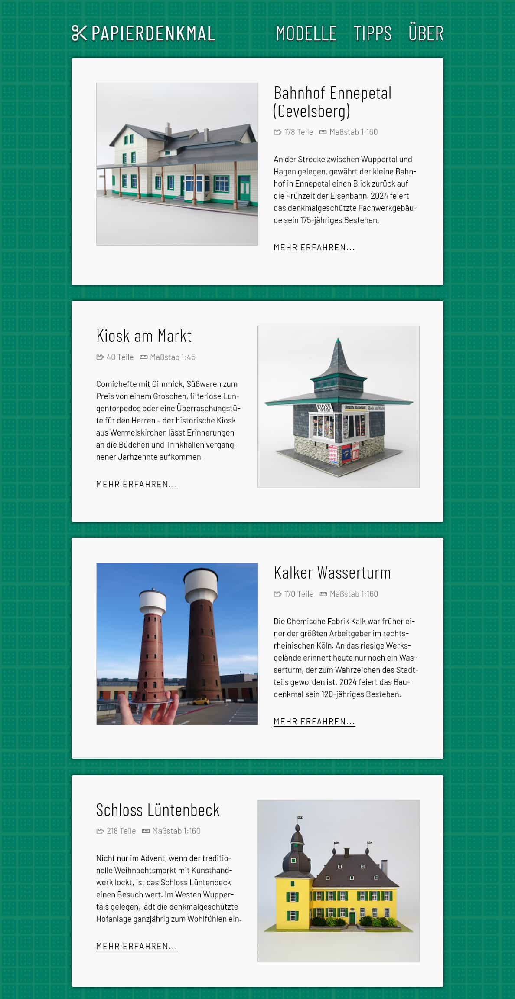

# Papierdenkmal

Auf der Website [www.papierdenkmal.de](https://www.papierdenkmal.de) stelle ich selbst konstruierte Architekturmodelle als Bastelbögen zum kostenfreien Download zur Verfügung. 

### Hintergrund

Entstanden sind die Modelle in den Jahren 2021 bis 2024, ursprünglich inspiriert durch den Abriss eines unscheinbaren Kioskgebäudes in meiner Heimatstadt. Die emotionalen Reaktionen der Bevölkerung auf den Verlust des liebgewonnenen Verkaufspavillons brachten mich auf die Idee, das Gebäude als Modell zu „konservieren“.

Im Anschluss entstanden dreizehn weitere Bastelbögen, deren Umfang und Schwierigkeitsgrad variieren: Von [besagtem Kiosk](https://papierdenkmal.de/pilzkiosk/index.html), bestehend aus 40 Teilen, bis zum [Oberhausener Gasometer](https://papierdenkmal.de/gasometer/index.html) mit über 440 Teilen ist für jede Fähigkeitsstufe eine passende Herausforderung dabei.

### Umsetzung

Die Anfertigung eines Papiermodells erfolgt sehr kleinschrittig. Sie beginnt in der Regel mit einer Vielzahl an Fotos und – im Idealfall – mit einer Begehung vor Ort. Sofern es sich um ein komplexes (und womöglich gar nicht mehr existentes) Gebäude handelt, ist der Aufwand der Recherche nicht zu unterschätzen: Über jeden Winkel müssen genaue Informationen vorliegen, um anschließend ein wirklichkeitsnahes Abbild entwerfen zu können.

Sobald mir für die Umsetzung einer Idee ausreichend Informationen vorlagen, erfolgte in einem zweiten Schritt die Konstruktion mit Hilfe von SketchUp. Auch Zerlegung in Einzelteile erfolgte händisch im CAD-Programm. Über den Export als EPS-Datei gelangten die Blanko-Bauteile anschließend in die Grafik-Tools *Affinity Designer* und *Affinity Photo*, mit denen ich die Texturen ausgearbeitet und die finalen Bögen gestaltet habe[^1].

Die Website, zu Beginn noch unter der Domain *www.schwelmer-pilz.de* zu erreichen, wurde von Beginn an bewusst als statische Internetpräsenz ohne Datenbank und CMS angelgt. Weil die Entwicklung eines Papiermodells häufig sehr zeitaufwendig ist, war von Anfang an klar, dass der Umfang der Seite nur langsam wachsen wird und Aktualisierungen nur selten erfolgen. Dennoch lagen die Dateien der Seite über Jahre hinweg bei einem dedizierten Hoster, ehe sie im Frühjahr 2026 zu Github umzogen.

[^1]: Dies ist eine sehr verkürzte Darstellung der Arbeitsschritte. Meist sind mehrere Interationen und damit verbundene Testbauten nötig, ehe ein Modell entstanden ist, das problemlos und zuverlässig baubar ist. Auch das Anfertigen einer nachvollziehbaren Anleitung ist mit nicht geringem Aufwand verbunden.
